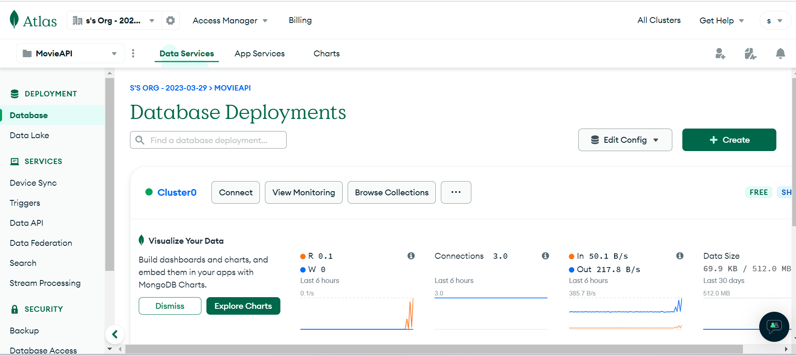
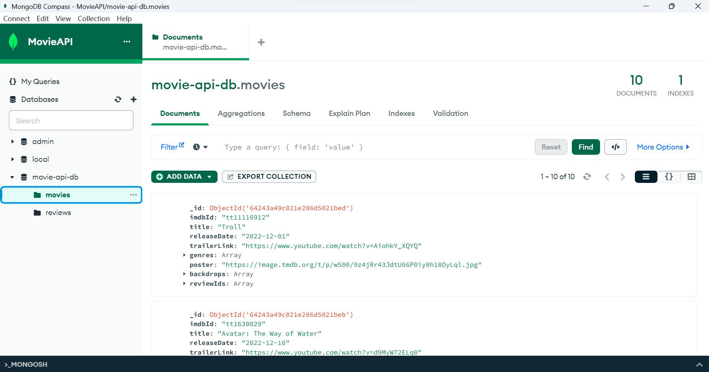
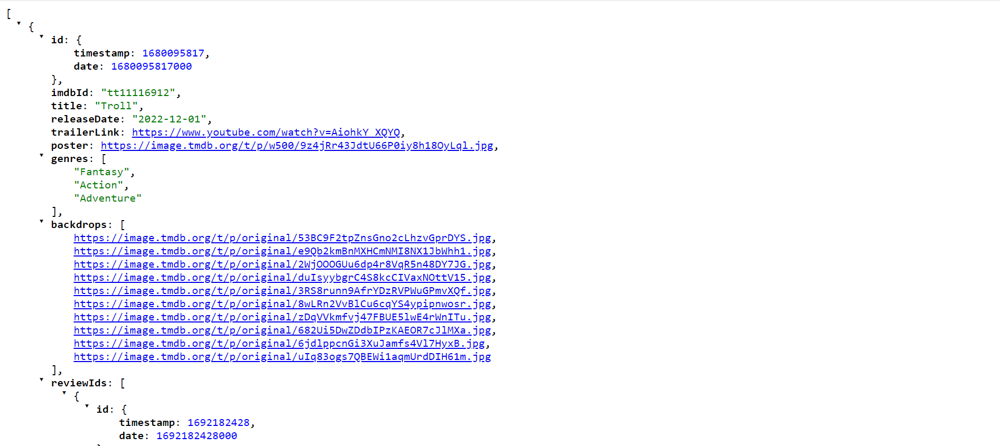
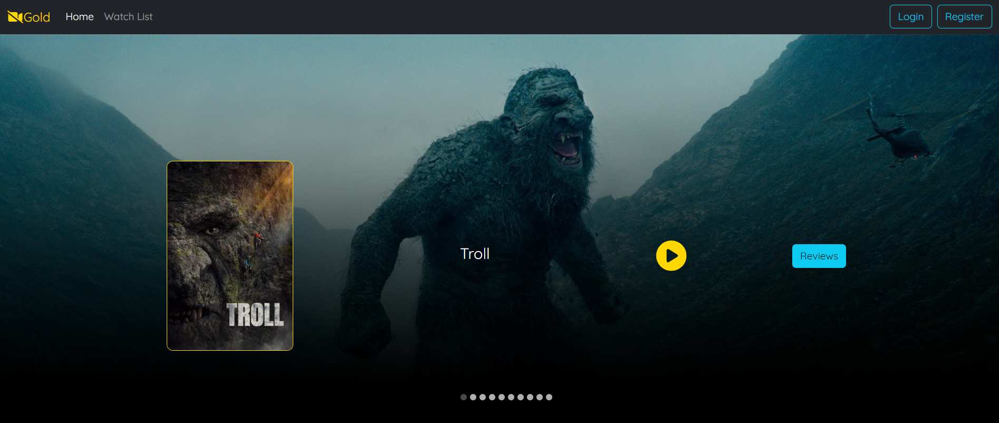
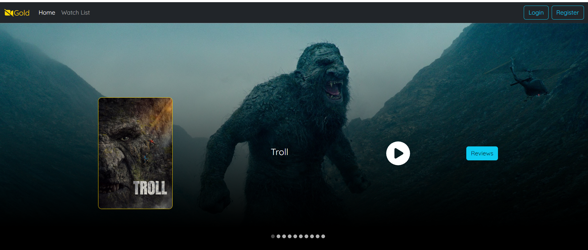
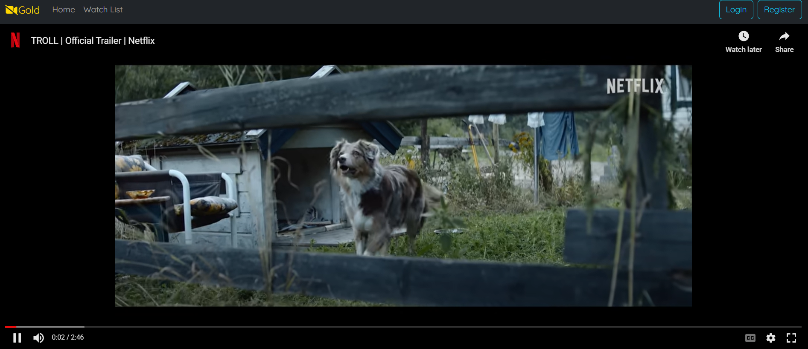
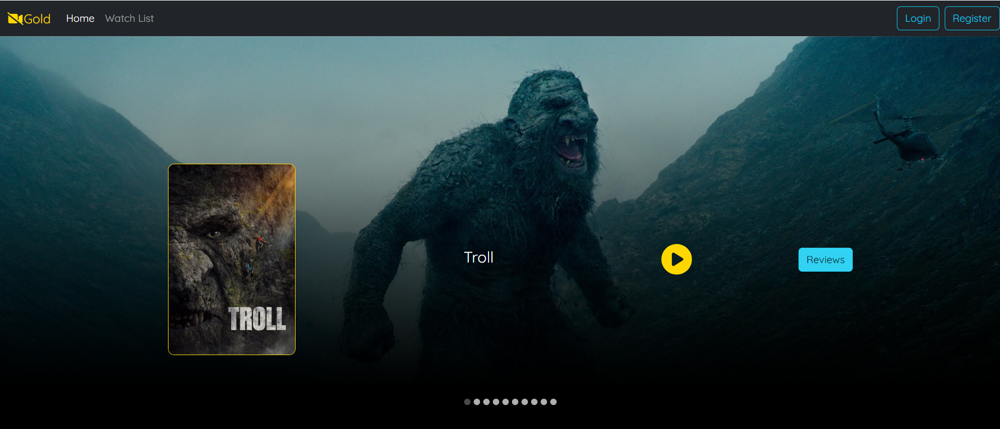
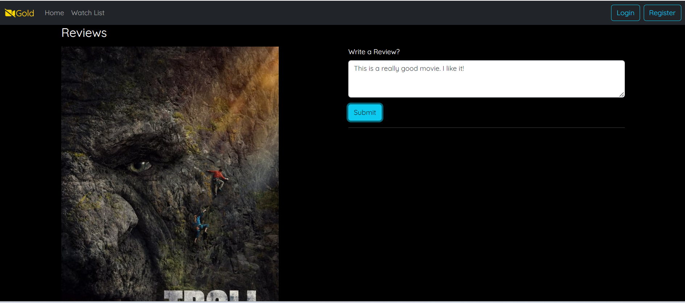
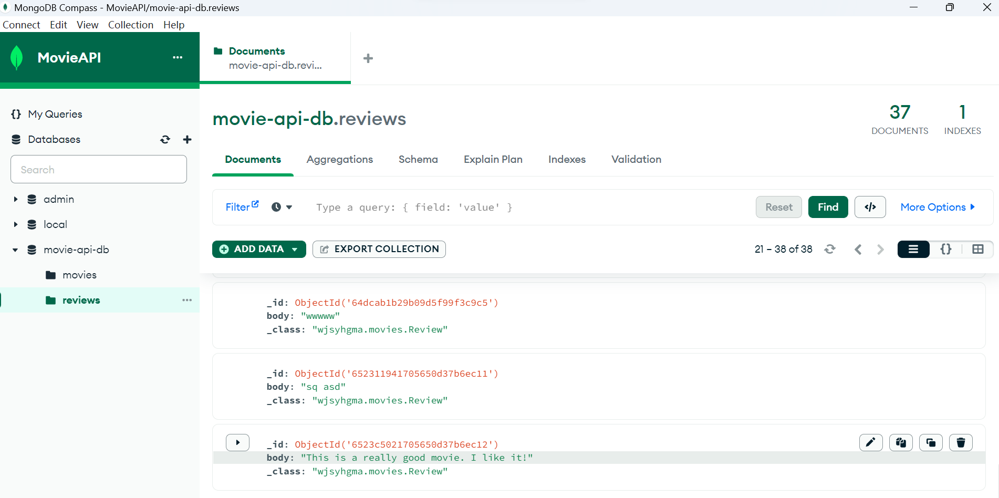
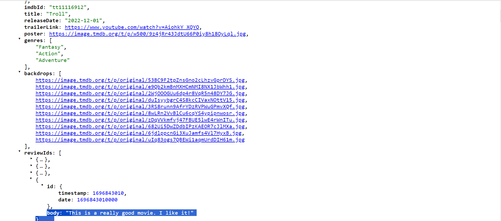

# Project Demo

https://react-moviereview-production.up.railway.app/

## MongoDB Atlas Database



### MongoDB Compass



## Springboot back-end

https://springboot-moviereviewapphosting-production.up.railway.app/api/v1/movies



### Code

#### Movie

```
@RestController
@RequestMapping("/api/v1/movies")
public class MovieController {
    @Autowired
    private MovieService movieService;
    @GetMapping
    public ResponseEntity<List<Movie>> getAllMovies(){

        return new ResponseEntity<List<Movie>>(movieService.allMovies(), HttpStatus.OK);
    }

    @GetMapping("/{imdbId}")
    public ResponseEntity<Optional<Movie>> getSingleMovie(@PathVariable String imdbId){
        return new ResponseEntity<Optional<Movie>>(movieService.singleMovie(imdbId), HttpStatus.OK);
    }
}
```

#### Review

```
@RestController
@RequestMapping("api/v1/reviews")
public class ReviewController {
    @Autowired
    private  ReviewService reviewService;

    @PostMapping
    public ResponseEntity<Review> createReview(@RequestBody Map<String, String> payload){
        return new ResponseEntity<Review>(reviewService.createReview(payload.get("reviewBody"), payload.get("imdbId")), HttpStatus.CREATED);
    }
}

```

## React front-end

https://react-moviereview-production.up.railway.app/



### Trailer

Click the yellow play button




### Create reviews

Click the blue reviews button


Type your comment and submit


The user's review will be saved in the MongoDB Atlas database



